# Jenkins Master example

This directory contains an example of a Jenkins setup that is configured to
demonstrate the CI-CD/pipeline workflow for the ose-sample-app application using the
Jenkins Master/Slave setup and automation done on OpenShift v3.

<p align="center">
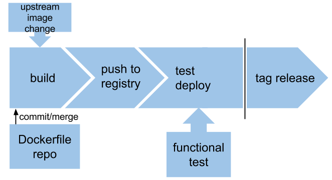
</p>

## Installation

### Pre-Req
Docker API need to be exposed on one of the OSE nodes. Login to the ose node and do the following:

```
vi /lib/systemd/system/docker.service 
OPTIONS="-D -H tcp://0.0.0.0:2376 -H unix:///var/run/docker.sock"

ExecStart=/bin/sh -c '/usr/bin/docker-current daemon -H tcp://0.0.0.0:2376 -H unix:///var/run/docker.sock \

sudo sysctl -w net.ipv4.ip_forward=1
sudo touch /etc/sysctl.d/80-docker.conf
echo 'net.ipv4.ip_forward = 1' | sudo tee --append /etc/sysctl.d/80-docker.conf > /dev/null
  
systemctl daemon-reload
systemctl restart docker
```
Make sure the IP Tables service is accepting port 2376
```
sudo iptables -A OS_FIREWALL_ALLOW -p tcp -m state --state NEW -m tcp --dport 2376
sudo service iptables save
sudo service iptables restart
```

To start, you have to manually enter following commands in OpenShift:


```console

# Bootstrap the CI project
$ oc login -u nitin ose3cluster.services.marvin.caplatformdev.com
$ ./bootstrap.sh

```

## Instantiating templates from OpenShift web console

Navigate to the OpenShift UI and choose the `ci` project we created in the previous
step. 

<p align="center">
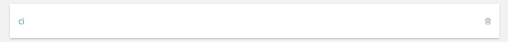
</p>

Note: To continue, you have to first create your Jenkins Slave image. Please see
the [instructions](../slave/README.md) here or follow the instructions below:

Now click *Add to Project* button as shown below:

<p align="center">
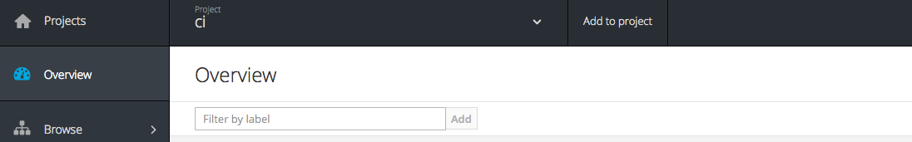
</p>

Choose slave template
<p align="center">
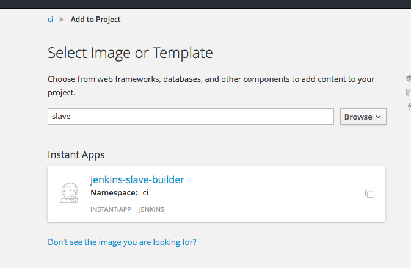
</p>

Verify the configuration and hit create. This would start the slave build porcess. Make sure that the build has been completed successfully.
<p align="center">
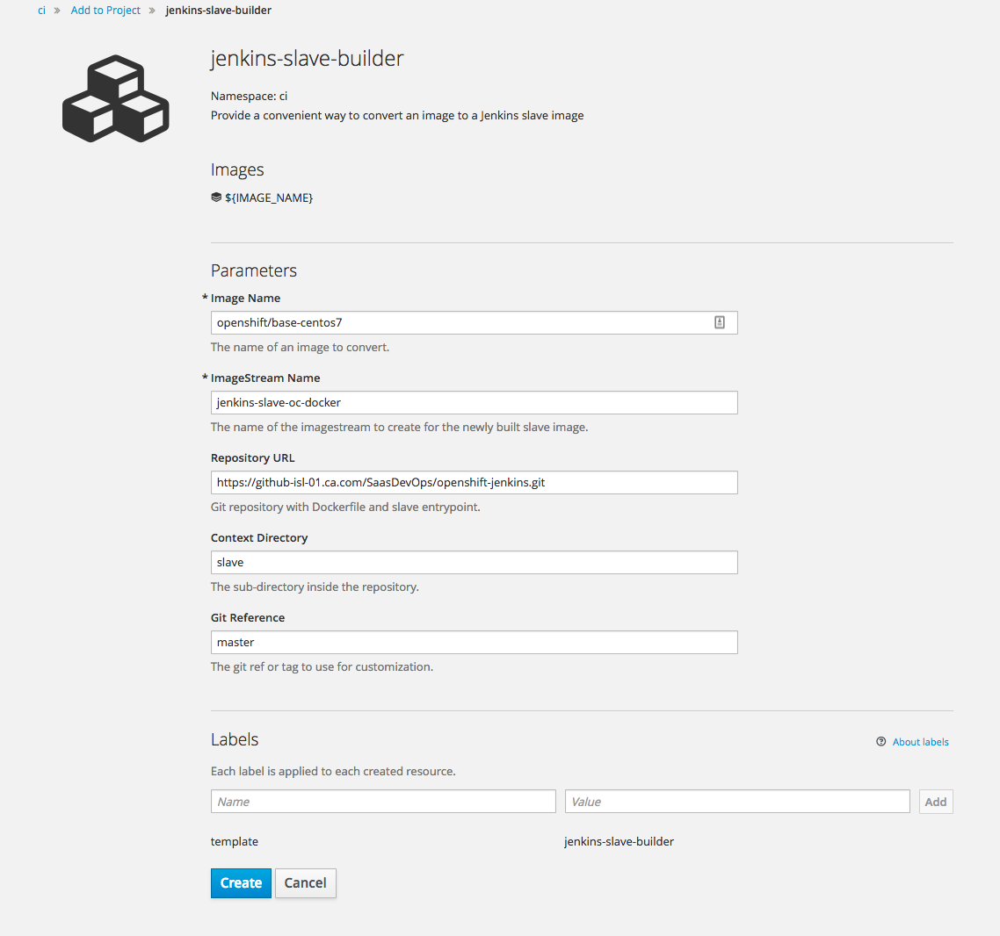
</p>
<p align="center">
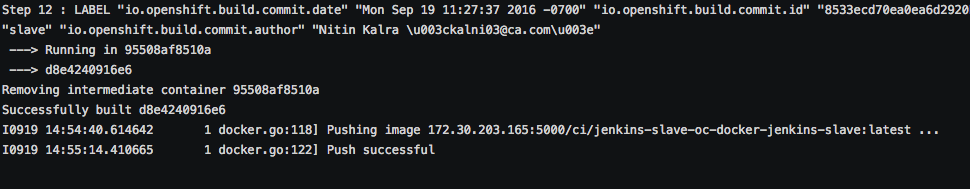
</p>

Once slave is build hit *Add to Project* button and choose the master template. Verify the configuration and hit *Create*. This would start a deployment for Master. Verify a pod for mastter has come up
<p align="center">
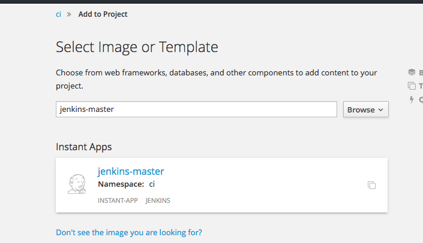
</p>
<p align="center">
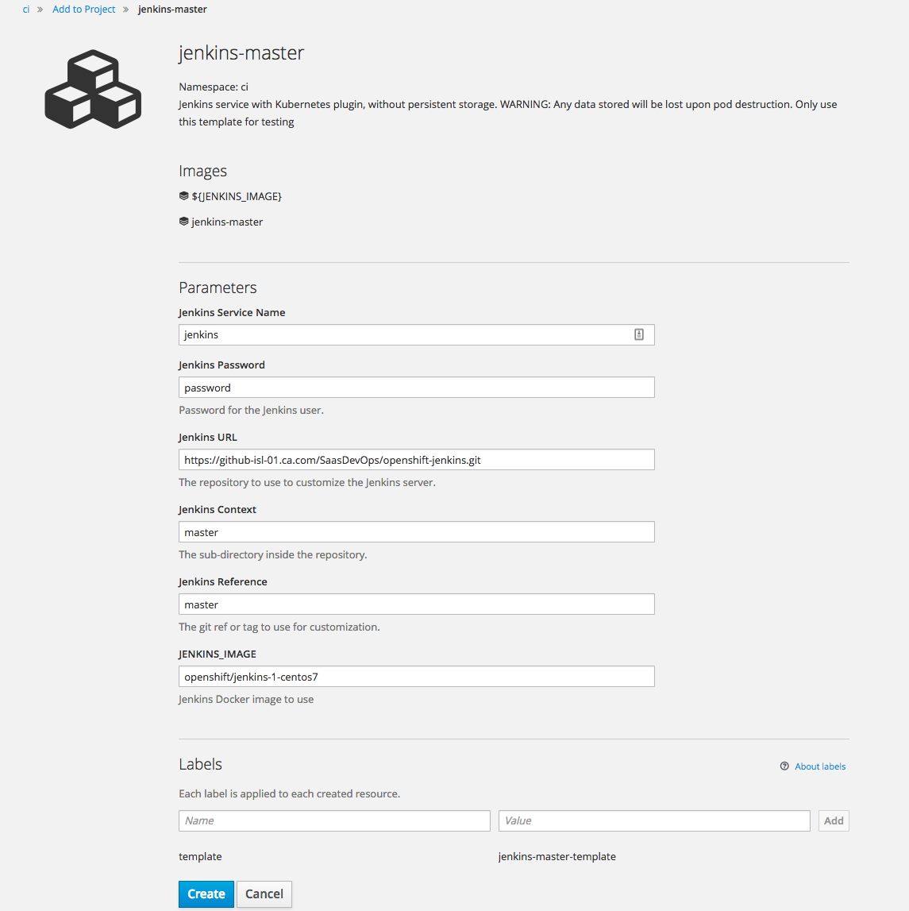
</p>
<p align="center">
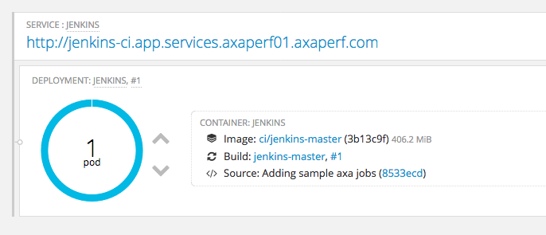
</p>

Once Jenkins pod is up and running hit the route and open up Jenkins. Enter the username as "admin" and password as the credentials entered during the config stage. Default password is "password". 
Once logged in, you need to configure Jenkins for openshift and other environmental variables.
<p align="center">
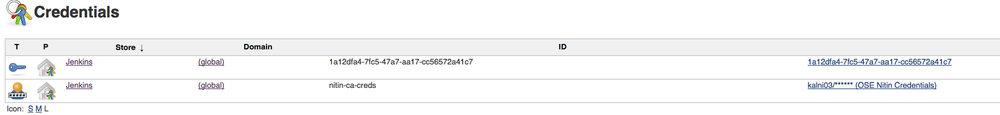
</p>
This should be the IP address of the openshift node which was configured to expose Docker API.
<p align="center">
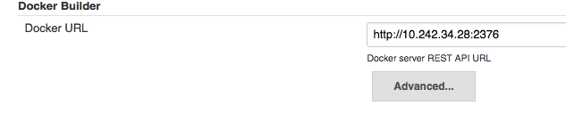
</p>
This would be the Openshift cluster admin username and password
<p align="center">
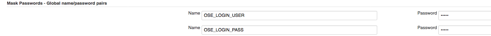
</p>

<p align="center">
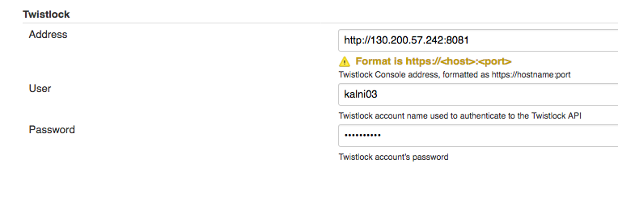
</p>
Make sure you provide the correct label of the node which was configured to expose Docker API.
<p align="center">
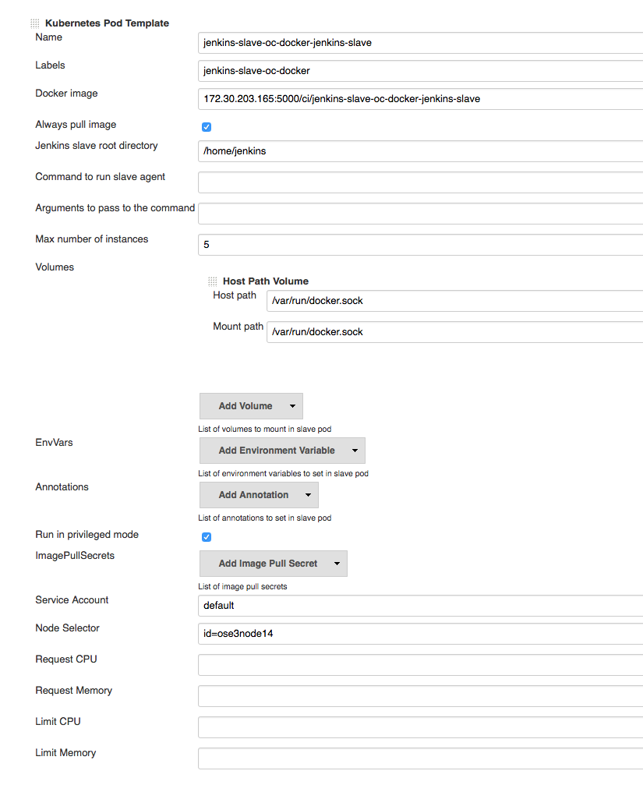
</p>


### Application Setup 

TO make sure that the jenkins can do deployment on a given namespace, give jenkins service account edit permissions to the target namespace

```
oc policy add-role-to-user edit system:serviceaccount:ci:default -n ***PROJECT_NAME***
```
## Workflow
